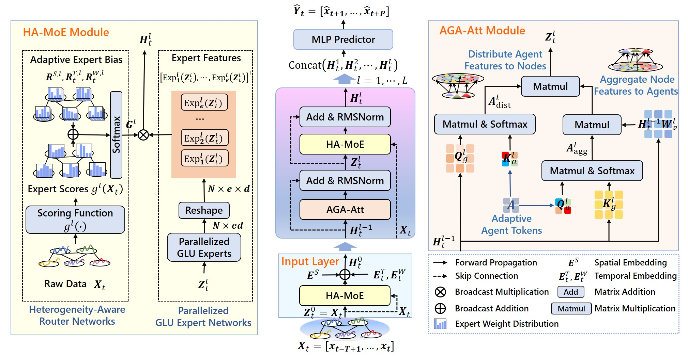
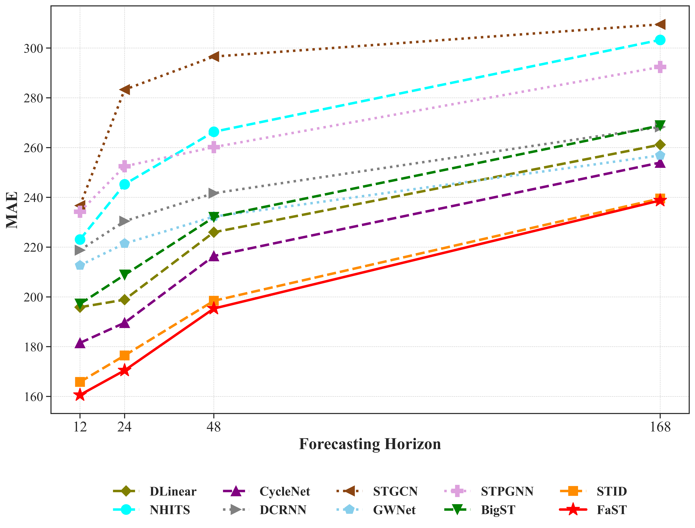
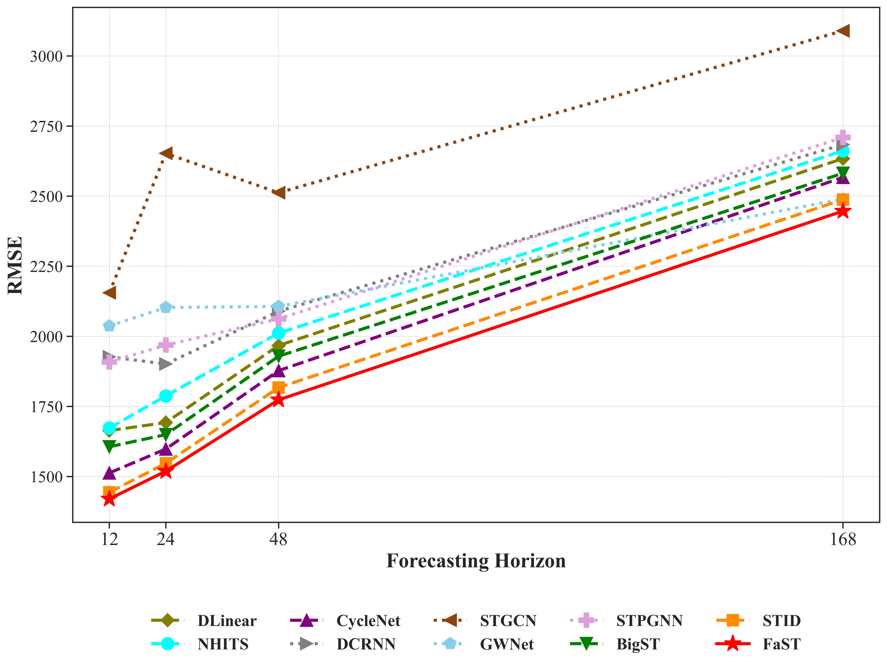
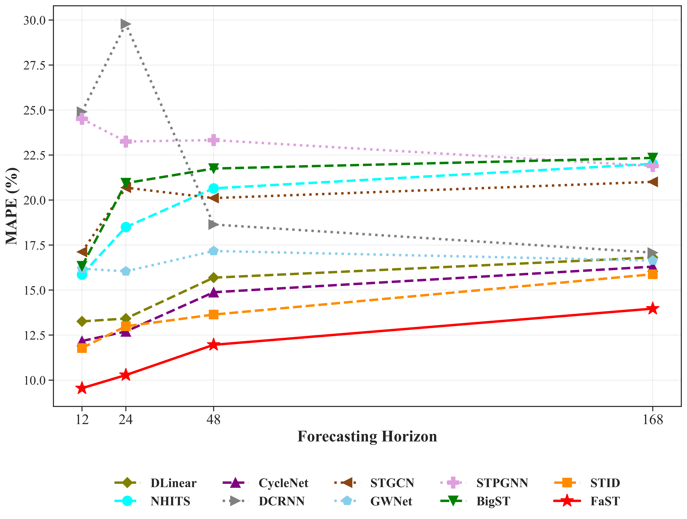
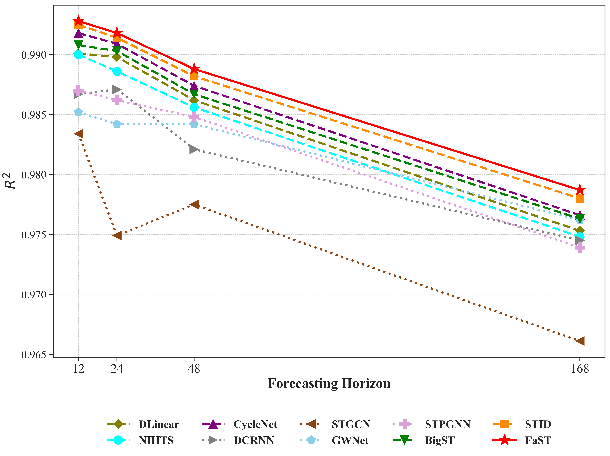
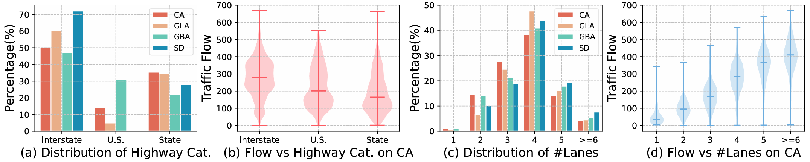
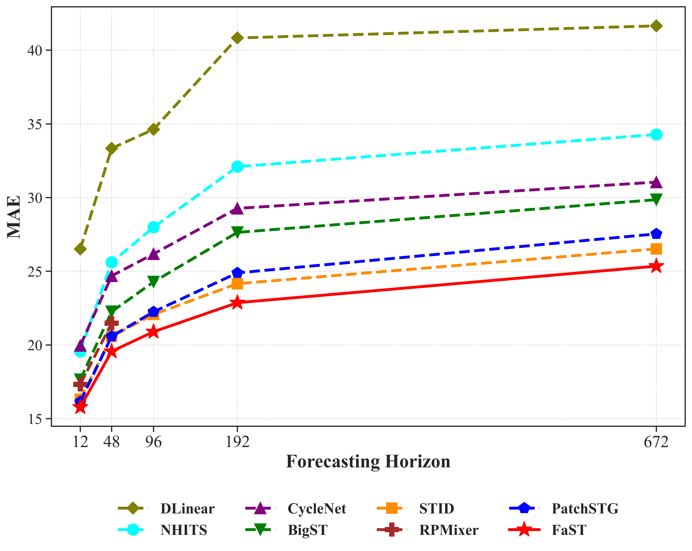
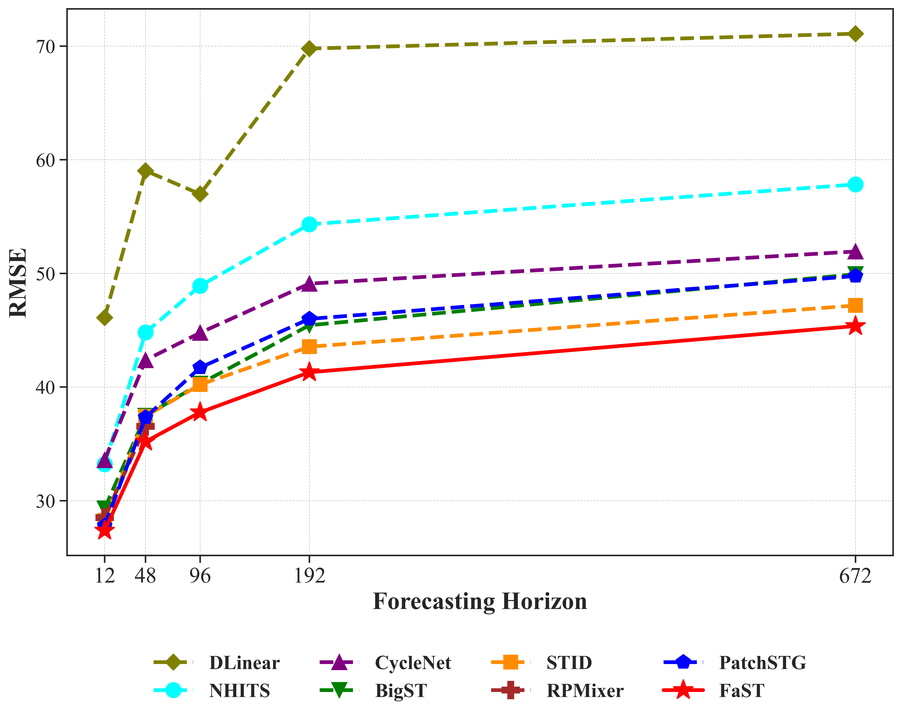
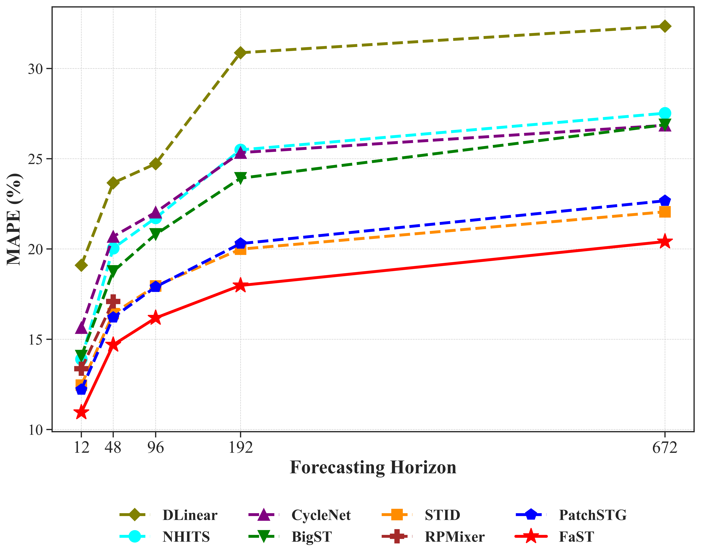
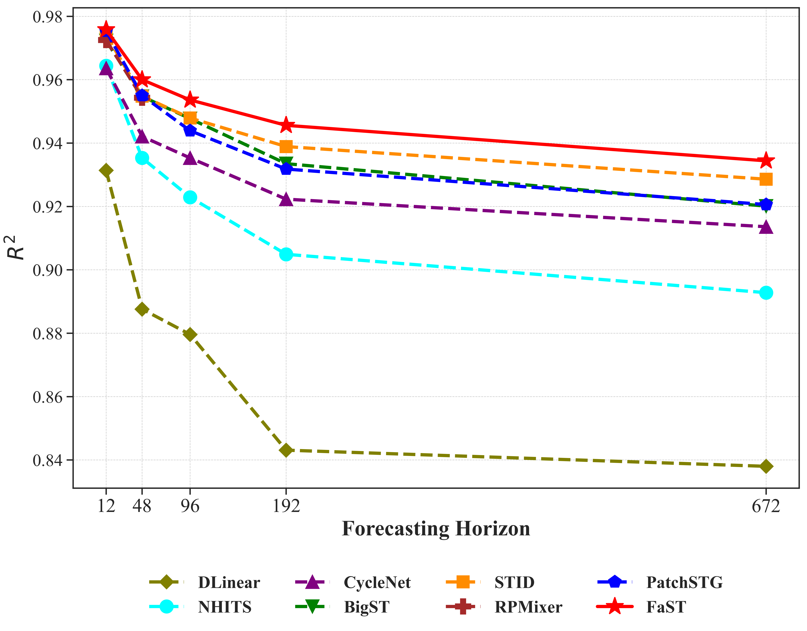

# FaST




**Figure 2. Architecture of FaST.** **① Input Layer:** The heterogeneity-aware MoE module (HA-MoE) assigns expert scores via the heterogeneity-aware router and integrates parallelized GLU expert features, converting input sequences into dense feature vectors. These features are subsequently enhanced with adaptive spatial and temporal embeddings. **② Network Backbone:** Composed of stacked residual blocks. Each block utilizes the Adaptive Graph Agent Attention (AGA-Att) module to aggregate node features into a small number of adaptive agent tokens, redistributing them to nodes, followed by residual addition and normalization. Then, the HA-MoE module integrates expert outputs, followed by residual addition and normalization. This block leverages AGA-Att's low-rank approximation of pairwise interactions and HA-MoE enhancement to efficiently capture diverse spatiotemporal patterns. **③ Prediction Layer:** Outputs from all layers are concatenated and input into a multi-layer perceptron (MLP) predictor to generate prediction results.


## 1. Supplementary Experiment

---

### 1.1 Model Generalization on New Dataset

To assess generalization, we further evaluate on **Electricity dataset** (321 nodes, 1-hour intervals, Spatial Similarity Ratio=66.34%) with horizons of 24⇒{12,24,48,168}. The FaST model performs well on this dataset, achieving superior predictive performance compared to baselines by 12-19% MAPE.

<p align="center">
  <b>Table&nbsp;1</b> Performance comparisons on the Electricity dataset.
</p>


<p align="center">
  
  
  
  
</p>
<p align="center"><b>Figure&nbsp;1</b> Electricity dataset results across forecasting horizons.</p>

Several baselines (RPMixer/SGP) will be added later due to data pipeline complexity.  

---
### 1.2 Empirical Results for Reconstruction Errors.

**Design Principle of Reconstruction Error**: To assess fidelity, the reconstruction error quantifies how effectively AGA-Att preserves input features post-approximation. As defined in Equation 11, AGA-Att($H_t^{l-1}$) = $A_{\rm{dist}}^l (A_{\rm{agg}}^l H_t^{l-1} W_v^l)$. 
The effective projection matrix is $P^l = A_{\rm{dist}}^l A_{\rm{agg}}^l \in R^{N \times N}$, 
and the error is $$\epsilon^l = \|H_t^{l-1} - P^l H_t^{l-1}\|_F / \|H_t^{l-1}\|_F$$ (Frobenius norm, excluding $W_v^l$ for focused compression analysis, as it primarily serves as a learned transformation). This is a low-rank approximation of a full attention matrix, akin to the Nyström method for kernel approximation [1].

Table 2 reports reconstruction errors were computed on the SD dataset (96 => 48). For layer $l=1$, as the number of agent tokens *#agent* = \{16, 32, 64, 128\}, $\epsilon^1$ = \{0.611, 0.512, 0.488, 0.484\}, demonstrating a monotonic decrease and diminishing returns. This trend illustrates that raw spatial redundancy is most pronounced in early layers, where increasing *#agent* effectively captures more of the dominant modes, aligning with theoretical expectations for initial feature processing. However, the overall predictive performance reflects the cumulative effects across all layers, including refinements from HA-MoE. To quantify this, average reconstruction errors across layers were calculated: $\epsilon_{\text{avg}}$ = \{0.627, 0.620, 0.630, 0.632\}. Pearson correlation analysis reveals a **strong positive association** between $\epsilon_{\text{avg}}$ and both **MAE**=\{19.75, 19.37, 20.02, 19.87\} (`coefficient 0.929, p-value 0.071`) and **RMSE**=\{35.22, 34.54, 36.27, 36.23\} (`coefficient 0.955, p-value 0.045`), indicating that lower average fidelity corresponds to improved predictive accuracy. The optimal MAE/RMSE performance is achieved at *#agent* =32 while $\epsilon_{\text{avg}}$ is minimized, followed by a slight degradation due to layer interactions that enhance feature diversity. **Nonetheless, all errors remain bounded below 0.75 across configurations, confirming that the approximation suffices for downstream forecasting while enabling scalability.**

<p align="center">
  <b>Table&nbsp;2</b> Reconstruction errors on the SD dataset (96 => 48).
</p>

| agent | 16    | 32    | 64    | 128   |
|-|-|-|-|-|
| $\epsilon^1 (l=1)$ | 0.611 | 0.512 | 0.488 | 0.484 |
| $\epsilon^2 (l=2)$ | 0.617 | 0.685 | 0.726 | 0.755 |
| $\epsilon^3 (l=3)$ | 0.652 | 0.663 | 0.677 | 0.665 |
| $\epsilon_{\text{avg}}$   | 0.627 | 0.620 | 0.630 | 0.635 |
| MAE   | 19.75 | 19.37 | 20.02 | 19.87 |
| RMSE  | 35.22 | 34.54 | 36.27 | 36.23 |

---
### 1.3 Extensions to Other Fields

FaST is designed for datasets with **pronounced spatial redundancy** (e.g., traffic, power, environmental sensors) and **temporal heterogeneity** (e.g., daily peaks, trends). The framework works particularly well for `large-scale spatial-temporal data` with high spatial correlation and temporal variation.

**Quantifying Spatial Redundancy via Cosine Similarity.**

To operationalize applicability, we compute node-pair similarity on concatenated sequences (historical $T$ steps + ground-truth future $P$ steps), thereby capturing the full dynamics. For a dataset with $N$ nodes, at each time $t$ (sampled over $M$ windows), form sequences $\bf{s}_i^{(t)} = [\bf{x}_{t-T+1,i}, \dots, \bf{x}_{t,i}; \bf{x}_{t+1,i}, \dots, \bf{x}_{t+P,i}] \in R^{T+P}$ (normalized to zero-mean unit-variance). Cosine similarity between nodes $i,j$:

$$
S_{ij}^{(t)} = \frac{\bf{s}_i^{(t)} \cdot \bf{s}_j^{(t)}}{\|\bf{s}_i^{(t)}\|_2 \|\bf{s}_j^{(t)}\|_2} = \frac{\sum_{k=1}^{T+P} s_{i,k}^{(t)} s_{j,k}^{(t)}}{\sqrt{\sum_{k=1}^{T+P} (s_{i,k}^{(t)})^2} \sqrt{\sum_{k=1}^{T+P} (s_{j,k}^{(t)})^2}}
$$

The redundancy ratio (proportion of highly similar pairs, threshold $\tau=0.7$) is:

$$
\text{Ratio} = \frac{N_{\text{highly similar}}}{N_{\text{total possible}}} = \frac{\sum_{t=1}^{M} \sum_{i=1}^{N-1} \sum_{j=i+1}^{N} \mathbb{I}(S_{ij}^{(t)} > \tau)}{M \cdot \frac{N(N-1)}{2}}
$$

**Analysis**: On traffic (LargeST: SD/GBA/GLA/CA, $T=96, P=672$): Ratios = {48.36%, 41.62%, 45.80%, 41.87%}, reflecting high redundancy, which justifies that AGA-Att's agent tokens are fewer needed for summarization. 

**Extensions to Other Fields**: FaST naturally extends, replacing traffic flows with variables such as electricity demand, precipitation, or temperature. For meteorology (e.g., stations as nodes, edges by distance): High spatial redundancy (regional weather patterns) suits AGA-Att; non-stationarity (seasonal/diurnal) benefits HA-MoE. 
Similar to traffic data, power demand datasets often exhibit high spatial redundancy (e.g., power stations across a region) and temporal heterogeneity (e.g., daily load cycles, seasonal trends). FaST can be applied to power demand forecasting, where the model captures both the spatial correlations between power stations and the temporal dynamics of energy consumption. Limitations: For sparse/low-redundancy graphs (e.g., social networks), increase $a$; for extreme non-stationarity, add trend decomposition pre-processing.

---
### 1.4 Statistics on Traffic Datasets

The dataset statistics are summarized in **Table 1**.

<p align="center"><b>Table&nbsp;3</b> Dataset statistics.</p>

| Data | #nodes | Edges   | Degree | Time interval | Time range           | Std    | Mean   | #Samples       | Similarity | Missing rate | Max_value | Features     |
| ---- | ------ | ------- | ------ | ------------- | -------------------- | ------ | ------ | -------------- | ---------- | ------------ | --------- | ------------ |
| SD   | 716    | 17,319  | 24.2   | 15 minute     | [1/1/2019, 1/1/2020) | 184.02 | 244.31 | 24.5M～25.0M   | 48.36%     | 5.67%        | 999       | traffic flow |
| GBA  | 2,352  | 61,246  | 26.0   | 15 minute     | [1/1/2019, 1/1/2020) | 166.67 | 239.82 | 80.6M～82.1M   | 41.62%     | 5.86%        | 998       | traffic flow |
| GLA  | 3,834  | 98,703  | 25.7   | 15 minute     | [1/1/2019, 1/1/2020) | 187.77 | 276.82 | 131.4M～133.8M | 45.80%     | 5.72%        | 999       | traffic flow |
| CA   | 8,600  | 201,363 | 23.4   | 15 minute     | [1/1/2019, 1/1/2020) | 177.12 | 237.39 | 294.7M～300.1M | 41.87%     | 5.99%        | 999       | traffic flow |

**Figure 2** illustrates how two critical meta features  (**highway categories** and **number of lanes**) relate to traffic flow.
- **(a)** and **(c)** depict the distributions of these features across four real-world datasets, revealing notable differences in feature prevalence.  
- **(b)** and **(d)** present violin plots of traffic flow in the CA dataset, categorized by these features, further highlighting their impact on flow variations.

Such disparities arise from differences in road design, speed limits, and access control across highway types, which collectively shape traffic patterns.


<p align="center">
  
</p>
<p align="center"><b>Figure&nbsp;2</b> Impact of Highway Types and Lane Numbers on Traffic Flow [1].</p>

> For more dataset details, refer to [1].

---

### 1.5 Short-term Forecasting on Four Datasets

To evaluate short-horizon forecasting, we report 96⇒12 results on SD, GBA, GLA, and CA in Table 4, and prediction performance comparison across different horizons on the CA Dataset in Figure 3.

<p align="center">
  <b>Table&nbsp;4</b> Short-term forecasting comparisons on SD, GBA, GLA, and CA datasets (96⇒12).  
  "<b>OOM</b>" denotes out-of-memory errors.  
</p>


<p align="center">
  
  
  
  
</p>
<p align="center"><b>Figure&nbsp;3</b> Prediction Performance Comparison Across Different Horizons on the CA Dataset.</p>


---

### 1.5 $R^2$ on CA Dataset

We report the **$R^2$ (coefficient of determination)** metric on the **CA** dataset, which measures the **proportion of variance explained** by the model. Higher values (closer to 1) indicate better predictive performance. 

<p align="center">
  <b>Table&nbsp;5</b> Performance comparisons on the CA dataset (96⇒12/48/96/672).  
  <b>Bold</b> indicates first place,  
  <u>underline</u> indicates second place.  
  "<b>OOM</b>" denotes out-of-memory errors.  
</p>


---

### 1.6 Reproducibility Settings

<p align="center"><b>Table&nbsp;6</b> Batch size settings for all baselines.</p>

<p align="center">

</p>

---

### Reference

[1] Xu Liu, Yutong Xia, Yuxuan Liang, Junfeng Hu, Yiwei Wang, Lei Bai, Chao Huang, Zhenguang Liu, Bryan Hooi, and Roger Zimmermann. 2023. *LargeST: A Benchmark Dataset for Large-Scale Traffic Forecasting*. In NeurIPS 2023.


---


## 2. Experimental Details

### 2.1 Experimental Setting


The experimental evaluation is implemented using the `BasicTS` framework. The maximum number of training epochs for all methods is set to 50, with early stopping based on validation set performance to select the optimal model parameters. Performance is evaluated using MAE, RMSE, and MAPE metrics. All experiments are conducted on a system equipped with an AMD EPYC 7532 processor at 2.40 GHz, an NVIDIA RTX A6000 GPU with 48 GB of memory, 128 GB of RAM, and Ubuntu 20.04. The default deep learning library is PyTorch version 2.2.1, with Python version 3.11.8.

The FaST model employs the Adam optimizer with an initial learning rate of 0.002 and a weight decay parameter of 0.0001 for regularization. Mixed precision training is utilized to enhance computational efficiency and reduce memory usage. During training, the learning rate scheduling strategy utilizes MultiStepLR, which decays the learning rate by a factor of 0.5 every 10 epochs, starting from the 10th epoch, to facilitate multi-stage progressive optimization and promote stable model convergence.


### 2.2 Dataset Description

The CA dataset used in our report was collected from the Performance Measurement System (PeMS) by the authors of [1], and we obtained the data through that work. The San Diego (SD), Greater Los Angeles (GLA), and Greater Bay Area (GBA) areas are three representative subregions selected from the CA dataset, containing 716, 3834, and 2352 sensors, respectively. 


The dataset can be downloaded from the following link: https://www.kaggle.com/datasets/liuxu77/largest. The link contains seven files. To reproduce our experiment results, you need to download the following three files: `ca_his_raw_2019.h5`, `ca_meta.csv`, `ca_rn_adj.npy`.


Install environment dependencies using the following command:

```shell
pip install -r requirements.txt
```


Unzip the downloaded data into the `DataPipeline` directory. Then, use the following command to generate the traffic data required for model training:


```shell
bash DataPipeline.sh
```

### 2.3 Data Generation for Model Training


We use the 2019 SD, GBA, GLA, and CA datasets. First, we obtain all samples through a sliding window, then split the samples into training, validation, and test sets in a 6:2:2 ratio.
The generated data will be stored in the `main-master/datasets` directory. In each data directory, the `his.npz` file stores raw traffic flow values along with derived daily and weekly features. The `adj_mx.pkl` file contains the adjacency matrix for the data, and `desc.json` stores the data information. Other folders, such as `{input_len}_{output_len}`, store the sample indices for the training, validation, and test sets for the corresponding forecasting length.


### 2.4 Training FaST Model


Run the following commands to train the FaST on different datasets and forecasting lengths:

```shell
# FaST on SD dataset
python main-master/experiments/train_seed.py -c FaST/SD_96_48.py -g 0
python main-master/experiments/train_seed.py -c FaST/SD_96_96.py -g 0
python main-master/experiments/train_seed.py -c FaST/SD_96_192.py -g 0
python main-master/experiments/train_seed.py -c FaST/SD_96_672.py -g 0

# FaST on GBA dataset
python main-master/experiments/train_seed.py -c FaST/GBA_96_48.py -g 0
python main-master/experiments/train_seed.py -c FaST/GBA_96_96.py -g 0
python main-master/experiments/train_seed.py -c FaST/GBA_96_192.py -g 0
python main-master/experiments/train_seed.py -c FaST/GBA_96_672.py -g 0

# FaST on GLA dataset
python main-master/experiments/train_seed.py -c FaST/GLA_96_48.py -g 0
python main-master/experiments/train_seed.py -c FaST/GLA_96_96.py -g 0
python main-master/experiments/train_seed.py -c FaST/GLA_96_192.py -g 0
python main-master/experiments/train_seed.py -c FaST/GLA_96_672.py -g 0

# FaST on CA dataset
python main-master/experiments/train_seed.py -c FaST/CA_96_48.py -g 0
python main-master/experiments/train_seed.py -c FaST/CA_96_96.py -g 0
python main-master/experiments/train_seed.py -c FaST/CA_96_192.py -g 0
python main-master/experiments/train_seed.py -c FaST/CA_96_672.py -g 0
```

### 2.5 FaST Model Reproduction: Reproducing FaST's experiment results using our trained parameters

Due to storage limitations in the anonymous repository, we only release trained parameters for the SD dataset. These parameters are sufficient to reproduce the core results reported in this paper.

The trained parameters for other datasets will be released to a publicly accessible cloud drive after the paper is accepted, ensuring full reproducibility.


To reproduce the results on the SD dataset, please execute the following commands:


``` shell
# Reproducing FaST results on the SD dataset
python main-master/experiments/evaluate.py -cfg  FaST/SD_96_48.py -ckpt Parameters_FaST/SD/96_48/FaST_best_val_MAE.pt -g 0
python main-master/experiments/evaluate.py -cfg  FaST/SD_96_96.py -ckpt Parameters_FaST/SD/96_96/FaST_best_val_MAE.pt -g 0
python main-master/experiments/evaluate.py -cfg  FaST/SD_96_192.py -ckpt Parameters_FaST/SD/96_192/FaST_best_val_MAE.pt -g 0
python main-master/experiments/evaluate.py -cfg  FaST/SD_96_672.py -ckpt Parameters_FaST/SD/96_672/FaST_best_val_MAE.pt -g 0
```
### 2.6 Experimental Results

<p align="center">
<b>Table&nbsp;8</b> presents the performance comparison of different models on time series forecasting tasks. "T" refers to temporal-centric methods, while "ST" denotes spatial-temporal-centric methods. Best-performing results are bolded. The notation "96=>48" denotes training on the past 96 time steps to predict the next 48.
</p>

<p align="center"><b>Table&nbsp;8</b> Performance comparisons.</p>


### 2.7 Baseline Reproduction

Use the following commands to reproduce baseline models:

```shell
# STID
bash script/STID.sh

# DLinear
bash script/DLinear.sh

# NHITS
bash script/NHITS.sh

# CycleNet
bash script/CycleNet.sh

# DCRNN
bash script/DCRNN.sh

# BigST
bash script/BigST.sh

# STGCN
bash script/STGCN.sh

# STPGNN
bash script/STPGNN.sh

# GWNet
bash script/GWNet.sh

# STDMAE
# Please add the paths of the two pre-trained models to the configuration file of STDMAE.
bash script/STDMAE.sh

# PatchSTG
bash script/PatchSTG.sh

# SGP
# Please refer to: ‘https://github.com/Graph-Machine-Learning-Group/sgp’ to configure the relevant environment
bash script/SGP.sh

# RPMixer
# Please refer to: ‘https://sites.google.com/view/rpmixer’ to configure the relevant environment
bash script/SGP.sh

```


