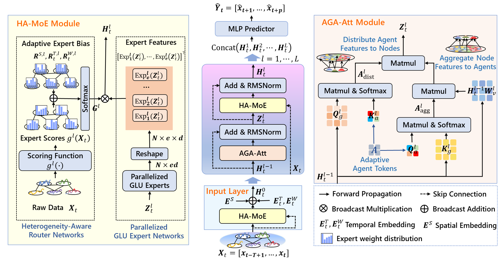
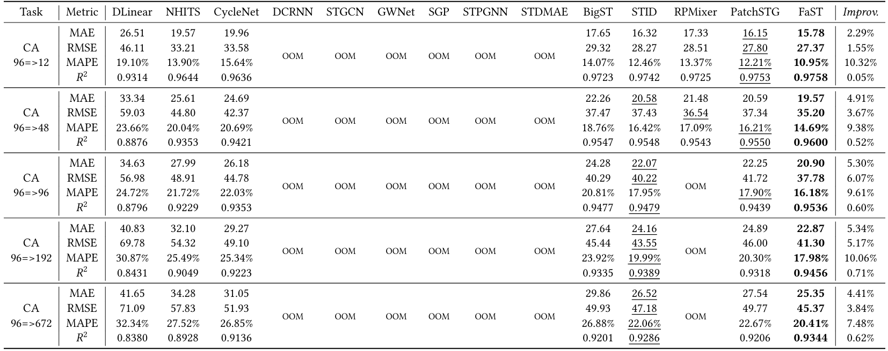
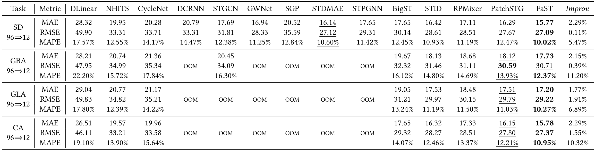
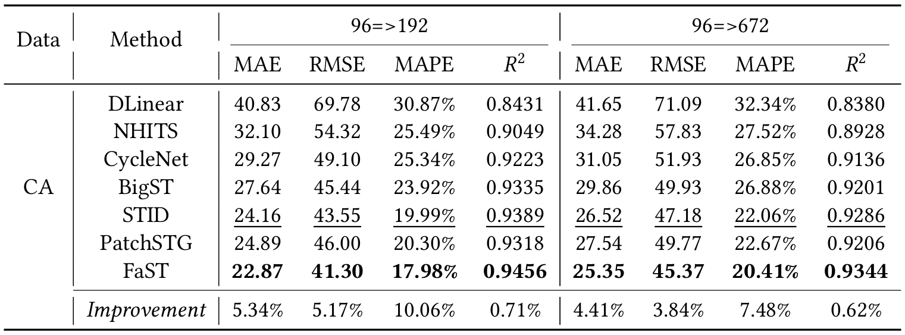
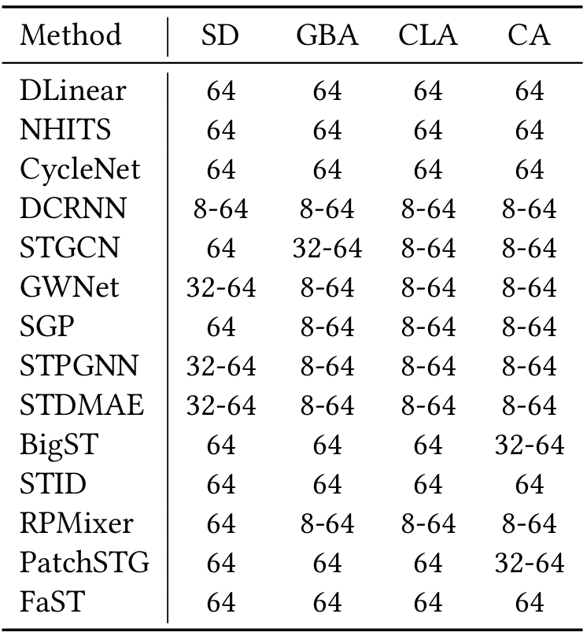
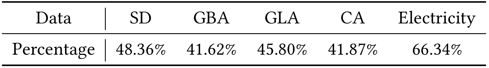

# FaST

The architecture of FaST, as shown in Figure 1, comprises three components: 1) Temporal Compression Input with MoE to condense historical sequences into low-dimensional representations. 2) Heterogeneity-aware MoE with a router and GLU experts for the extraction of various spatial-temporal characteristics. 3) Adaptive Graph Agent Attention Module for efficient long-range spatial interactions and multilayer feature capture.



<p align="center"><b>Figure&nbsp;1</b> Architecture of FaST.</p>

## 1. Supplementary Experiment

Dataset statistics are summarized in **Table 1**.


<p align="center"><b>Table&nbsp;1</b> Dataset statistics.</p>

| Data | #nodes | Time interval | Time range           | Std    | Mean   | Features     | #Samples       |
| ---- | ------ | ------------- | -------------------- | ------ | ------ | ------------ | -------------- |
| SD   | 716    | 15 minute     | [1/1/2019, 1/1/2020) | 184.02 | 244.31 | traffic flow | 24.5M～25.0M   |
| GBA  | 2,352  | 15 minute     | [1/1/2019, 1/1/2020) | 166.67 | 239.82 | traffic flow | 80.6M～82.1M   |
| GLA  | 3,834  | 15 minute     | [1/1/2019, 1/1/2020) | 187.77 | 276.82 | traffic flow | 131.4M～133.8M |
| CA   | 8,600  | 15 minute     | [1/1/2019, 1/1/2020) | 177.12 | 237.39 | traffic flow | 294.7M～300.1M |

For more dataset details, refer to literature [1].

**Reference**

[1] Xu Liu, Yutong Xia, Yuxuan Liang, Junfeng Hu, Yiwei Wang, Lei Bai, Chao Huang, Zhenguang Liu, Bryan Hooi, and Roger Zimmermann. 2023. LargeST: A Benchmark Dataset for Large-Scale Traffic Forecasting. In The Annual Conference on Neural Information Processing Systems. New Orleans, LA, USA.

Thank you for the constructive suggestion. We have added and reported the **$R^2$ (coefficient of determination)** metric on the **CA** dataset. $R^2$ measures the **proportion of variance explained** by the model, ranging over $(-\infty, 1]$; values closer to 1 indicate a better fit/prediction, whereas negative values indicate performance worse than a simple baseline (e.g., predicting the mean). On **CA**, our method attains the **best $R^2$**, corroborating its effectiveness. Detailed numbers appear in **Tables 2**. We also include the **12-step-ahead** setting to assess short-horizon performance; the corresponding results are incorporated into **Tables 2** and align with our main findings. **Figure 2** visualizes these performance comparisons, clearly illustrating our model's consistent superiority across all metrics and forecasting horizons. **Table 3** shows 96⇒12 forecasting results on SD, GBA, GLA, and CA.

Beyond that, we add experiments on the **Electricity** dataset spanning **24⇒12/24/48/168** horizons to evaluate robustness and generalization across look-ahead settings. The results are summarized in **Table 4** and remain consistent with those on other datasets.  **Figure 3** visualizes these performance comparisons, clearly illustrating our model's consistent superiority across all metrics and forecasting horizons.

In addition, **Table 5** lists the **batch-size** configurations used by different models across datasets to facilitate reproducibility and ensure a fair comparison. **Table 6** further reports the spatial similarity ratio across datasets (cosine similarity > 0.7 at the same timestamp), providing a concise reference for cross-node correlation.


<p align="center">
  <b>Table&nbsp;2</b> Performance comparisons on the CA dataset (96⇒12/48/96/672).  
  <b>Bold</b> indicates first place,  
  <u>underline</u> indicates second place.  
  The notation "96⇒12" denotes training on the past 96 time steps to predict the next 12 time steps.  
  "<i>Improv.</i>" is the percentage improvement of the FaST model over the best baseline.  
  "<b>OOM</b>" indicates out-of-memory errors.  
</p>




<p align="center">
  
  
  
  
</p>
<p align="center"><b>Figure&nbsp;2</b> Performance Evaluation of Models across Different Forecasting Horizons on the CA Dataset.</p>

<p align="center">
  <b>Table&nbsp;3</b> Short-term forecasting comparisons on the SD, GBA, GLA, and CA datasets (96⇒12).  
  <b>Bold</b> indicates first place,  
  <u>underline</u> indicates second place.  
  The notation "96⇒12" denotes training on the past 96 time steps to predict the next 12 time steps.  
  "<b>OOM</b>" indicates out-of-memory errors due to resource limitations.  
</p>



<p align="center">
  <b>Table&nbsp;4</b> Performance comparisons on the Electricity dataset (24⇒12/24/48/168).  
  <b>Bold</b> indicates first place,  
  <u>underline</u> indicates second place.  
  The notation "24⇒12" denotes training on the past 24 time steps to predict the next 12 time steps.  
  "<i>Improv.</i>" is the percentage improvement of the FaST model over the best baseline.  
  <br><i>Note:</i> Several baseline methods are not yet included due to the complexity of their data pipelines, and will be added in future updates.
</p>




<p align="center">
  
  
  
  
</p>
<p align="center"><b>Figure&nbsp;3</b> Performance Evaluation of Models across Different Forecasting Horizons on the Electricity Dataset.</p>


<p align="center"><b>Table&nbsp;5</b> Batch size settings for all baselines.</p>

<p align="center">

</p>


<p align="center"><b>Table&nbsp;6</b> Proportion of Samples with Spatial Similarity (Percentage of sample pairs with cosine similarity > 0.7 at the same timestamp). </p>

<p align="center">

</p>

**Reconstruction Error**

Regarding the reconstruction error, it is computed as follows:

- $H_{t} \in \mathbb{R}^{N\times D}$: node representations **before** the graph–agent attention layer.
- $A_{g2a} \in \mathbb{R}^{a\times N}$: Graph→Agent attention (row-wise softmax over $N$).
- $A_{a2g} \in \mathbb{R}^{N\times a}$: Agent→Graph attention (row-wise softmax over $a$).

Construct the projection matrix:

$P = A_{a2g}\,A_{g2a} \in \mathbb{R}^{N\times N}.$


The overall **reconstruction error** is defined as:

$\mathrm{\varepsilon} = \frac{\lVert H_{t} - P H_{t} \rVert_F}{\lVert H_{t} \rVert_F},$

where $\lVert \cdot \rVert_F$ denotes the Frobenius norm.

**Table 7** shows how the normalized reconstruction error changes as **#agents** increases from {16, 32, 64, 128}.

<p align="center"><b>Table&nbsp;7</b> Reconstruction Error. </p>

<p align="center">

</p>

## 2. Experimental Details

### 2.1 Experimental Setting


The experimental evaluation is implemented using the `BasicTS` framework. The maximum number of training epochs for all methods is set to 50, with early stopping based on validation set performance to select the optimal model parameters. Performance is evaluated using MAE, RMSE, and MAPE metrics. All experiments are conducted on a system equipped with an AMD EPYC 7532 processor at 2.40 GHz, an NVIDIA RTX A6000 GPU with 48 GB of memory, 128 GB of RAM, and Ubuntu 20.04. The default deep learning library is PyTorch version 2.2.1, with Python version 3.11.8.

The FaST model employs the Adam optimizer with an initial learning rate of 0.002 and a weight decay parameter of 0.0001 for regularization. Mixed precision training is utilized to enhance computational efficiency and reduce memory usage. During training, the learning rate scheduling strategy utilizes MultiStepLR, which decays the learning rate by a factor of 0.5 every 10 epochs, starting from the 10th epoch, to facilitate multi-stage progressive optimization and promote stable model convergence.


### 2.2 Dataset Description

The CA dataset used in our report was collected from the Performance Measurement System (PeMS) by the authors of [1], and we obtained the data through that work. The San Diego (SD), Greater Los Angeles (GLA), and Greater Bay Area (GBA) areas are three representative subregions selected from the CA dataset, containing 716, 3834, and 2352 sensors, respectively. 


The dataset can be downloaded from the following link: https://www.kaggle.com/datasets/liuxu77/largest. The link contains seven files. To reproduce our experiment results, you need to download the following three files: `ca_his_raw_2019.h5`, `ca_meta.csv`, `ca_rn_adj.npy`.


Install environment dependencies using the following command:

```shell
pip install -r requirements.txt
```


Unzip the downloaded data into the `DataPipeline` directory. Then, use the following command to generate the traffic data required for model training:


```shell
bash DataPipeline.sh
```

### 2.3 Data Generation for Model Training


We use the 2019 SD, GBA, GLA, and CA datasets. First, we obtain all samples through a sliding window, then split the samples into training, validation, and test sets in a 6:2:2 ratio.
The generated data will be stored in the `main-master/datasets` directory. In each data directory, the `his.npz` file stores raw traffic flow values along with derived daily and weekly features. The `adj_mx.pkl` file contains the adjacency matrix for the data, and `desc.json` stores the data information. Other folders, such as `{input_len}_{output_len}`, store the sample indices for the training, validation, and test sets for the corresponding forecasting length.


### 2.4 Training FaST Model


Run the following commands to train the FaST on different datasets and forecasting lengths:

```shell
# FaST on SD dataset
python main-master/experiments/train_seed.py -c FaST/SD_96_48.py -g 0
python main-master/experiments/train_seed.py -c FaST/SD_96_96.py -g 0
python main-master/experiments/train_seed.py -c FaST/SD_96_192.py -g 0
python main-master/experiments/train_seed.py -c FaST/SD_96_672.py -g 0

# FaST on GBA dataset
python main-master/experiments/train_seed.py -c FaST/GBA_96_48.py -g 0
python main-master/experiments/train_seed.py -c FaST/GBA_96_96.py -g 0
python main-master/experiments/train_seed.py -c FaST/GBA_96_192.py -g 0
python main-master/experiments/train_seed.py -c FaST/GBA_96_672.py -g 0

# FaST on GLA dataset
python main-master/experiments/train_seed.py -c FaST/GLA_96_48.py -g 0
python main-master/experiments/train_seed.py -c FaST/GLA_96_96.py -g 0
python main-master/experiments/train_seed.py -c FaST/GLA_96_192.py -g 0
python main-master/experiments/train_seed.py -c FaST/GLA_96_672.py -g 0

# FaST on CA dataset
python main-master/experiments/train_seed.py -c FaST/CA_96_48.py -g 0
python main-master/experiments/train_seed.py -c FaST/CA_96_96.py -g 0
python main-master/experiments/train_seed.py -c FaST/CA_96_192.py -g 0
python main-master/experiments/train_seed.py -c FaST/CA_96_672.py -g 0
```

### 2.5 FaST Model Reproduction: Reproducing FaST's experiment results using our trained parameters

Due to storage limitations in the anonymous repository, we only release trained parameters for the SD dataset. These parameters are sufficient to reproduce the core results reported in this paper.

The trained parameters for other datasets will be released to a publicly accessible cloud drive after the paper is accepted, ensuring full reproducibility.


To reproduce the results on the SD dataset, please execute the following commands:


``` shell
# Reproducing FaST results on the SD dataset
python main-master/experiments/evaluate.py -cfg  FaST/SD_96_48.py -ckpt Parameters_FaST/SD/96_48/FaST_best_val_MAE.pt -g 0
python main-master/experiments/evaluate.py -cfg  FaST/SD_96_96.py -ckpt Parameters_FaST/SD/96_96/FaST_best_val_MAE.pt -g 0
python main-master/experiments/evaluate.py -cfg  FaST/SD_96_192.py -ckpt Parameters_FaST/SD/96_192/FaST_best_val_MAE.pt -g 0
python main-master/experiments/evaluate.py -cfg  FaST/SD_96_672.py -ckpt Parameters_FaST/SD/96_672/FaST_best_val_MAE.pt -g 0
```
### 2.6 Experimental Results

<p align="center">
<b>Table&nbsp;8</b> presents the performance comparison of different models on time series forecasting tasks. "T" refers to temporal-centric methods, while "ST" denotes spatial-temporal-centric methods. Best-performing results are bolded. The notation "96=>48" denotes training on the past 96 time steps to predict the next 48.
</p>

<p align="center"><b>Table&nbsp;7</b> Performance comparisons.</p>


### 2.7 Baseline Reproduction

Use the following commands to reproduce baseline models:

```shell
# STID
bash script/STID.sh

# DLinear
bash script/DLinear.sh

# NHITS
bash script/NHITS.sh

# CycleNet
bash script/CycleNet.sh

# DCRNN
bash script/DCRNN.sh

# BigST
bash script/BigST.sh

# STGCN
bash script/STGCN.sh

# STPGNN
bash script/STPGNN.sh

# GWNet
bash script/GWNet.sh

# STDMAE
# Please add the paths of the two pre-trained models to the configuration file of STDMAE.
bash script/STDMAE.sh

# PatchSTG
bash script/PatchSTG.sh

# SGP
# Please refer to: ‘https://github.com/Graph-Machine-Learning-Group/sgp’ to configure the relevant environment
bash script/SGP.sh

# RPMixer
# Please refer to: ‘https://sites.google.com/view/rpmixer’ to configure the relevant environment
bash script/SGP.sh

```


